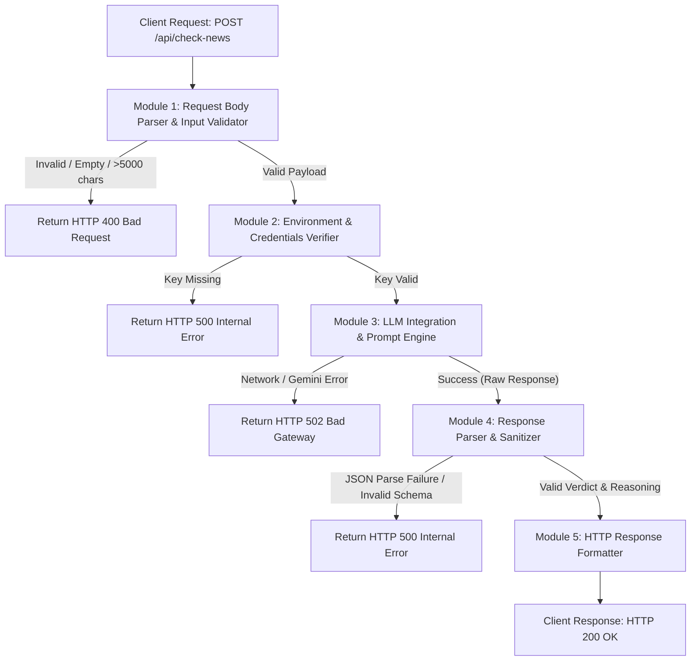

# 📄 Fake News Detection Project Report

---

## 🎯 Aim

The main objective of this project is to design, develop, and deploy an automated, AI-powered **Fake News Detection API** that utilizes Large Language Models (LLMs) to evaluate news headlines and article snippets. The system classifies incoming text into standard credibility categories (**"Likely Real"**, **"Likely Fake"**, or **"Uncertain"**) and provides contextual 1–2 sentence explanations justifying the classification.

---

## 🛠️ Tools

| Category | Tool / Technology | Description |
| :--- | :--- | :--- |
| **Framework** | Next.js 16 (App Router) | React-based full-stack framework providing serverless API endpoints |
| **Runtime Environment** | Node.js | Asynchronous event-driven JavaScript runtime |
| **Programming Language** | JavaScript (ES6+ / Node.js ES Modules) | Core language used for server-side logic and API integration |
| **AI Model & API** | Google Gemini 2.5 Flash (`generativelanguage.googleapis.com`) | Advanced Large Language Model fine-tuned for fast inference and fact-checking |
| **HTTP Client** | Native Fetch API | Modern web API used to execute asynchronous RESTful HTTP calls |
| **Package Manager** | npm (Node Package Manager) | Dependency management tool |
| **Version Control & Hosting** | Git / GitHub & Vercel | Version management and cloud platform deployment for serverless functions |
| **Environment Security** | Dotenv (`.env.local`) | Secure storage of sensitive credentials (API keys) |

---

## 📚 Theory

### 1. The Challenge of Fake News Detection
Fake news encompasses false or misleading information presented as news. It often manifests as sensationalized headlines, fabricated claims, opinion pieces disguised as facts, or logically inconsistent assertions designed to manipulate public perception. Manual fact-checking is slow and incapable of scaling to the volume of internet content.

### 2. Role of Natural Language Processing (NLP) & LLMs
Traditional machine learning approaches rely on static feature engineering (e.g., TF-IDF, bag-of-words) or basic classifier models (Naive Bayes, SVM, Bi-LSTM) trained on fixed datasets. These models struggle with evolving misinformation contexts and lack the ability to generate explanatory reasoning. 

Modern Large Language Models (such as Google Gemini 2.5 Flash) utilize Transformer architectures with self-attention mechanisms to:
* Interpret semantic nuance, context, and tone (e.g., clickbait, hyperbole, sensationalism).
* Cross-reference assertions against vast pre-trained world knowledge.
* Formulate structured classification along with logical rationale in real time.

### 3. Prompt Engineering & Deterministic Steering
To ensure reliability in a production backend, the model's output must be constrained:
* **System Instruction**: Explicitly defines the persona ("expert fact-checking assistant"), rules for classification, and output format requirements.
* **Low Temperature Sampling (`temperature: 0.2`)**: Reduces stochastic randomness and hallucination, favoring deterministic, highly predictable classification outputs.
* **Structured Output Enforcement (`responseMimeType: "application/json"`)**: Configures the API to return valid JSON adhering strictly to a predefined schema (`verdict` and `reasoning`).

---

## 📦 List of Assets

1. **`GEMINI_API_KEY` (Environment Secret)**: Authentication key authorizing serverless endpoint requests to Google Gemini AI.
2. **`.env.local`**: Local configuration file housing sensitive environment variables (excluded from version control via `.gitignore`).
3. **`package.json`**: Project manifest listing runtime dependencies (`next`, `react`, `react-dom`) and build scripts.
4. **`/api/check-news/route.js`**: Primary server-side API route handling HTTP `POST` requests, input verification, Gemini API execution, JSON parsing, and response formatting.
5. **System Prompt Constraint Matrix**: Internal specification guiding LLM verdict boundaries and output strictness.

---

## 📐 Module Design

The system architecture follows a linear, defensive pipeline designed for serverless execution.



### Module Descriptions

1. **Request Parsing & Input Validation Module**:
   * Extracts and validates the JSON payload from incoming `POST` requests.
   * Enforces sanitization rules: rejects empty inputs, non-string types, and inputs exceeding 5,000 characters to prevent buffer overflow or API abuse.

2. **Credential & Environment Module**:
   * Reads `GEMINI_API_KEY` securely from `process.env`.
   * Ensures zero credentials exposure to client-side environments.

3. **LLM Integration & Prompt Engineering Module**:
   * Formulates structured request body containing system instructions and user inputs.
   * Dispatches an HTTP `POST` request to `https://generativelanguage.googleapis.com/v1beta/models/gemini-2.5-flash:generateContent`.

4. **Response Parser & Sanitizer Module**:
   * Sanitizes raw LLM output using Regular Expression matching to extract embedded JSON objects.
   * Validates schema compliance: ensures `verdict` is restricted strictly to `["Likely Real", "Likely Fake", "Uncertain"]` and `reasoning` is a non-empty string.

5. **HTTP Response Formatter Module**:
   * Wraps verified output into standard JSON HTTP responses with corresponding status codes (`200 OK`, `400 Bad Request`, `502 Bad Gateway`, `500 Server Error`).

---

## 💻 Program (Main Backend Code)

> **Note**: As requested, only the main backend API logic (`app/api/check-news/route.js`) is included. All frontend components, UI templates, and styles are excluded.

```javascript
import { NextResponse } from "next/server";

const GEMINI_API_URL =
  "https://generativelanguage.googleapis.com/v1beta/models/gemini-2.5-flash:generateContent";

const SYSTEM_PROMPT = `You are an expert fact-checking assistant. A user will provide a news headline or article snippet.

Your task:
1. Analyze the text for signs of misinformation, sensationalism, logical inconsistencies, or known false claims.
2. Classify it as one of exactly three verdicts:
   - "Likely Real" — the content appears credible, uses measured language, and aligns with established facts.
   - "Likely Fake" — the content contains clear signs of misinformation, fabricated claims, extreme sensationalism, or logical impossibilities.
   - "Uncertain" — the content cannot be confidently classified either way (e.g., opinion pieces, claims requiring specialist knowledge, or insufficient context).
3. Write a 1–2 sentence reasoning explaining your classification.

IMPORTANT: You MUST respond with ONLY valid JSON — no markdown, no code fences, no extra text. Use this exact shape:
{"verdict": "<Likely Real | Likely Fake | Uncertain>", "reasoning": "<1-2 sentences>"}`;

export async function POST(request) {
  // 1. Parse body
  let body;
  try {
    body = await request.json();
  } catch {
    return NextResponse.json({ error: "Invalid request body." }, { status: 400 });
  }

  const { text } = body ?? {};

  // 2. Validate input
  if (!text || typeof text !== "string" || text.trim().length === 0) {
    return NextResponse.json(
      { error: "Please provide a non-empty 'text' field." },
      { status: 400 }
    );
  }

  if (text.trim().length > 5000) {
    return NextResponse.json(
      { error: "Text is too long. Please keep it under 5000 characters." },
      { status: 400 }
    );
  }

  // 3. Check API key
  const apiKey = process.env.GEMINI_API_KEY;
  if (!apiKey) {
    console.error("GEMINI_API_KEY environment variable is not set.");
    return NextResponse.json(
      { error: "Server configuration error. API key is missing." },
      { status: 500 }
    );
  }

  // 4. Call Gemini API
  let rawText;
  try {
    const geminiResponse = await fetch(`${GEMINI_API_URL}?key=${apiKey}`, {
      method: "POST",
      headers: { "Content-Type": "application/json" },
      body: JSON.stringify({
        system_instruction: {
          parts: [{ text: SYSTEM_PROMPT }],
        },
        contents: [
          {
            role: "user",
            parts: [{ text: text.trim() }],
          },
        ],
        generationConfig: {
          temperature: 0.2,
          maxOutputTokens: 1024,
          responseMimeType: "application/json",
        },
      }),
    });

    if (!geminiResponse.ok) {
      const errData = await geminiResponse.json().catch(() => ({}));
      console.error("Gemini API error:", geminiResponse.status, errData);
      return NextResponse.json(
        { error: "AI service is temporarily unavailable. Please try again." },
        { status: 502 }
      );
    }

    const geminiData = await geminiResponse.json();
    rawText = geminiData?.candidates?.[0]?.content?.parts?.[0]?.text ?? "";
  } catch (networkErr) {
    console.error("Network error calling Gemini:", networkErr);
    return NextResponse.json(
      { error: "Failed to reach the AI service. Please try again." },
      { status: 502 }
    );
  }

  // 5. Parse JSON response from model
  let parsed;
  try {
    // Robustly find JSON object {...} in rawText (handles preamble text or markdown fences)
    const jsonMatch = rawText.match(/\{[\s\S]*\}/);
    const jsonString = jsonMatch ? jsonMatch[0] : rawText.trim();
    parsed = JSON.parse(jsonString);
  } catch {
    console.error("Failed to parse model response:", rawText);
    return NextResponse.json(
      { error: "Unexpected response from AI. Please try again." },
      { status: 500 }
    );
  }

  // 6. Validate verdict field
  const VALID_VERDICTS = ["Likely Real", "Likely Fake", "Uncertain"];
  if (!VALID_VERDICTS.includes(parsed.verdict) || typeof parsed.reasoning !== "string") {
    console.error("Invalid model JSON shape:", parsed);
    return NextResponse.json(
      { error: "Unexpected response format from AI. Please try again." },
      { status: 500 }
    );
  }

  // 7. Return clean result
  return NextResponse.json(
    {
      verdict: parsed.verdict,
      reasoning: parsed.reasoning.trim(),
    },
    { status: 200 }
  );
}
```

---

## 🎓 Learning Outcome

Through the planning, architecture, and implementation of this project, the following core skills and technical competencies were acquired:

1. **RESTful API & Serverless Endpoint Architecture**: Gained practical experience in building clean, asynchronous HTTP API routes utilizing Next.js App Router serverless functions.
2. **LLM Integration & API Management**: Mastered connecting web backends to Google Gemini API using native HTTP `fetch`, payload formatting, and request parameter tuning (`temperature`, `maxOutputTokens`).
3. **Prompt Engineering & Output Constraining**: Learned how to construct precise system instructions to direct LLMs toward strict JSON responses and deterministic classifications.
4. **Defensive Programming & Error Handling**: Developed robust strategies for input validation, API key security, network fault tolerance, and regex-assisted JSON parsing from unstructured LLM outputs.
5. **Secure Configuration Management**: Implemented security best practices by isolating sensitive keys within environment variables.

---

## 🎯 Course Outcome

This project successfully aligns with standard Computer Science / Software Engineering / Artificial Intelligence course objectives:

* **CO1 — AI & Web Integration**: Ability to design web applications that leverage state-of-the-art Generative AI and LLM APIs to solve real-world problems (e.g., misinformation detection).
* **CO2 — Software Design Patterns & Modularization**: Ability to design modular software components with clear separation of concerns (input validation, integration, response parsing).
* **CO3 — Defensive System Design & Data Validation**: Proficiency in implementing edge-case validation, robust error logging, and standard HTTP status code communication.
* **CO4 — Ethical AI & Information Reliability**: Understanding the applications, capabilities, and limitations of AI-driven fact-checking systems in modern digital environments.

---

## 🏁 Conclusion

The **Fake News Detection** project successfully demonstrates an efficient, scalable, and secure backend solution for automated news credibility assessment. By integrating Next.js serverless architecture with Google's Gemini 2.5 Flash model, the system achieves rapid inference with structured JSON responses.

Key achievements of the project include:
1. Complete separation of key management and server side AI invocation from client environments.
2. Robust error handling preventing application crashes when handling malformed inputs or downstream API failures.
3. Deterministic output classification backed by brief, human-understandable reasoning.

**Future Scope**:
* Integrating web search grounding (e.g., Google Search API) to cross-reference real-time breaking news.
* Supporting multi-modal inputs (analyzing images/thumbnails alongside news headlines).
* Storing classification history and user feedback in a database for model evaluation.
